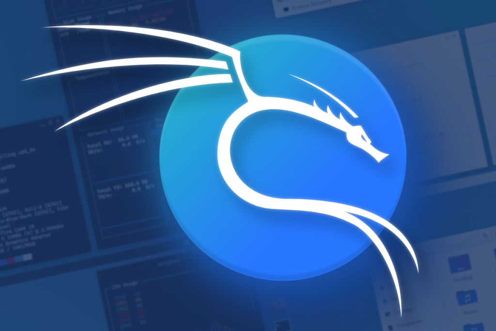
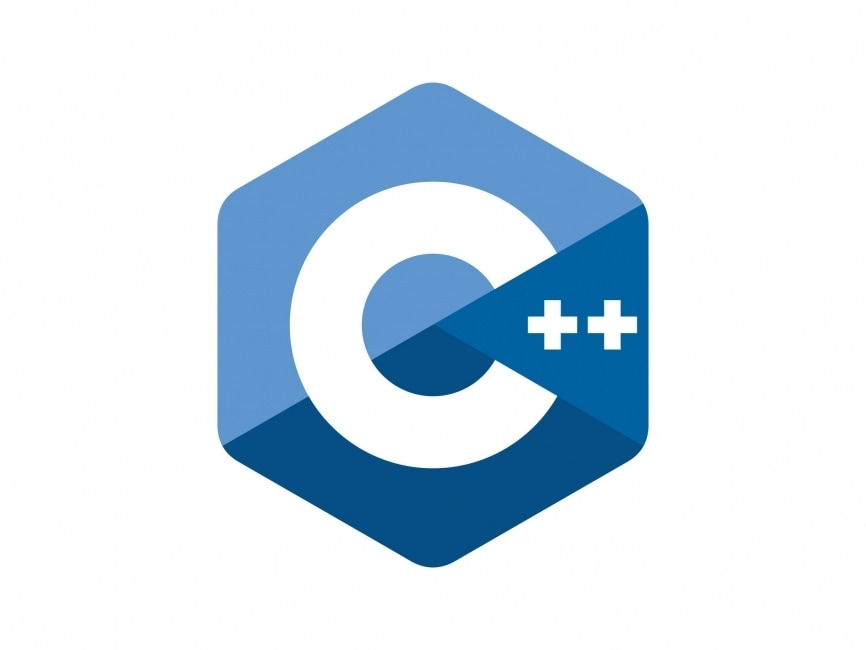
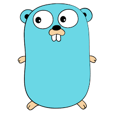
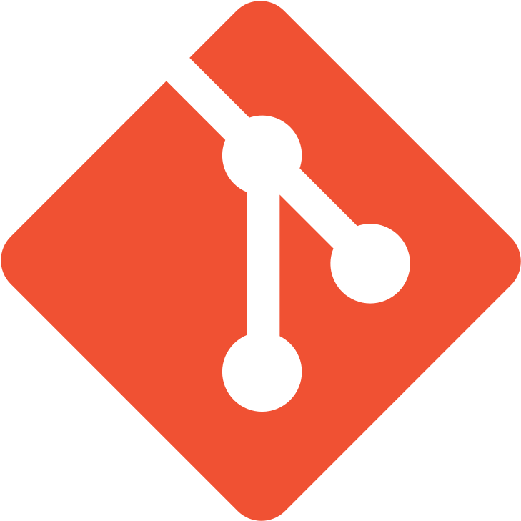

<section>
    <h1>Logos</h1>
</section>

<section>
    <section>
        <h3>Sistemas Operativos</h3>
    </section>
    <section>
		
	</section>
    <section>
		
	</section>
    <section>
		
	</section>
    <section>
		
	</section>
    <section>
		
	</section>
    <section>
    
  </section>
<section>
                
        </section>
  <section>
	
	</section> 
  <section> 
  
	</section>  

      <section>
		
	</section>
  <section>
		
	</section>
  
  <section>
		
	</section>

  <section>
		
	</section>

  <section>
		
	</section>

  <section>
		
	</section>

  <section>
		
	</section>

  <section>
		
	</section>

  <section>
		
	</section>

  <section>
		
	</section>

  <section>
		
	</section>

  <section>
		
	</section>

  <section>
		
	</section>
    <section>
		
	</section>
    <section>
		
	</section>
    <section>
		
	</section>
    <section>
		
	</section>
	<section>
		
	</section>
</section>

<section>
    <section>
        <h3>Lenguajes de programacion</h3>
    </section>
    <section>
        
    </section>
    <section>
        
    </section>
    <section>
        
    </section>
<section>
                
        </section>
        <section>
        
    </section>
<section>
    
  </section>
  <section>
      
  </section>
  <section>
      
  </section>
<section>
    
</section>

<section>
    
</section>

<section>
    
</section>

<section>
    
</section>

<section>
    
</section>

<section>
    
</section>

<section>
    
</section>

<section>
    
</section>

<section>
    
</section>

<section>
    
</section>
<section>
    
</section>

</section>   

<section>
  <section>
    <h3>Tecnologías</h3>
  </section>
  <section>
    
  </section>
  <section>
		
    </section>
  <section>
    
  </section>
  <section>
    
  </section>
  <section>
    
  </section>
  <section>
    
  </section>
</section>

<section>
  <section>
    <h3>DevOps</h3>
  </section>
  <section>
    
  </section>
  <section>
    
  </section>
  <section>
    
  </section>
  <section>
    
  </section>
<section>
    
  </section>
  <section>
    
  </section>
</section>
